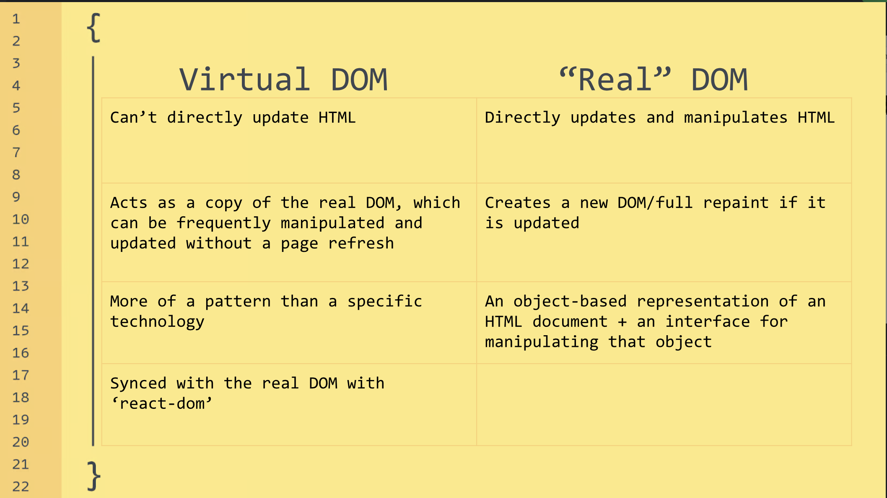

# Virtual DOM

<ul><li>
<p><strong>What is the difference between Virtual DOM and Real DOM ?</strong></p>
<p></p>
The key difference is diffing.
</li>
<li>
Is the Virtual DOM is same as the shadow DOM? <br>
No that's a seperate browser-specific technology.
</li>
</ul>

# React Limitation
- It's a library not a framework.
- It is Large.
- Being owned by Facebook also open-source.

# JSX

- What is JSX?  
  JSX stands for javascript XML.  
  Write JavaScript with HTML like templete syntax (not HTML, not a string!)  
  Produces elements that represent elements.

- What is the difference between element and component?  
    compoenent is a function that return an element.

- Can you write react without JSX?  
    YES!
```javascript 
 const Component = () => React.createElement('div', null, 'Hellllooooo!')

const domElement = document.getElementById('root')

ReactDOM.render(<Component />, domElement)
```


# Props

- How do you pass a value from parent to child and child to parent?  
 using props and functional props respectively.

- What is prop drilling?  
 Passing props from top level component to lower component by passing through intermediate components.

- Can you modify prop?  
 NO!!, props are read-only. Because all the react components must be pure functions.


# State and Lifecycle

- What is the difference between state and props?  
- What is a diffence between state in a class component and state in a functional component?  
- What is the components LifeCycle ?  
  1. Mounting
  2. Updating (optional)
  3. Unmounting

- How do you update the lifecycle of the component?  
 state updating and maybe useEffect hook.

# useEffect

- What parameters does useEffect takes in?  
The first one is the effect function and the second one is the dependency array.
- when does the effect function runs  
when dependency array is  
  [ ] => Run on mount.  
  [variable] => Runs on mount and variable change.  
  No array => Runs on mount and every state change.  

- What does the useEffect's function return?  
 cleanup function
  
